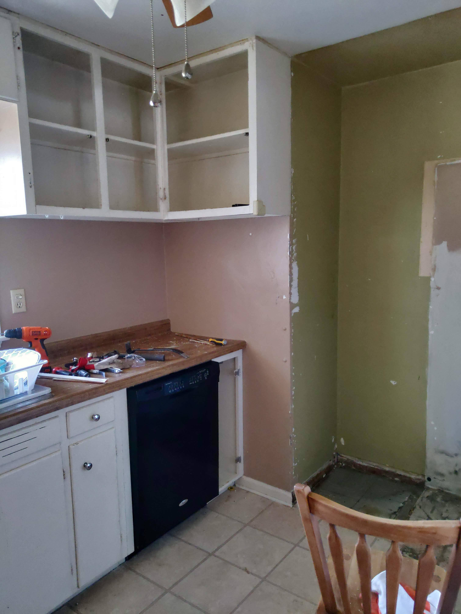
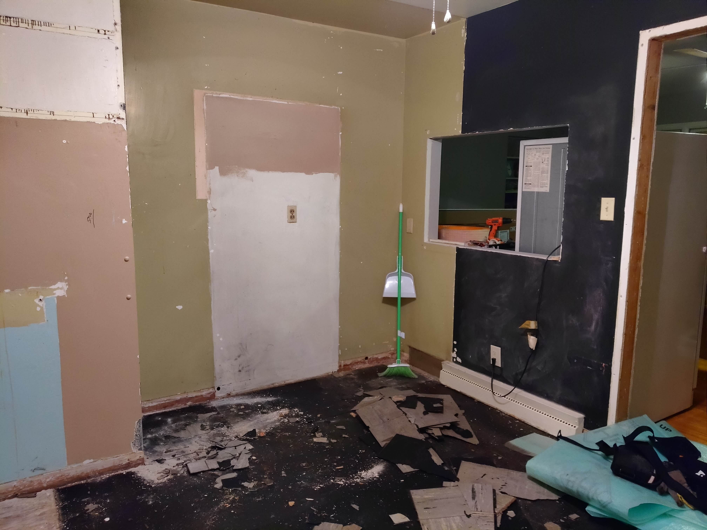
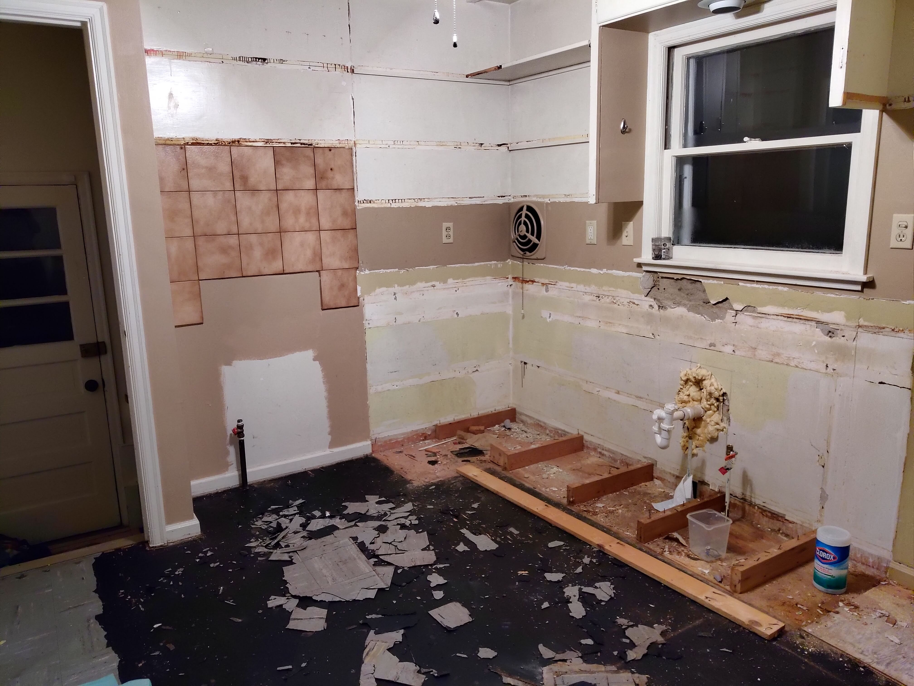
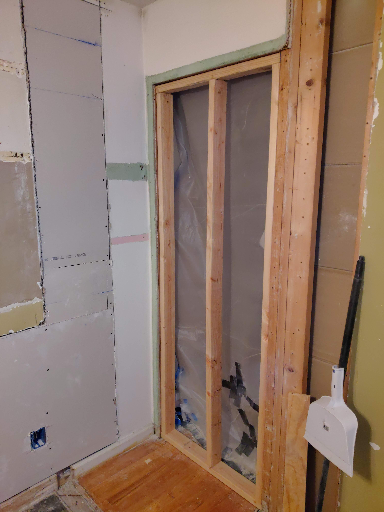
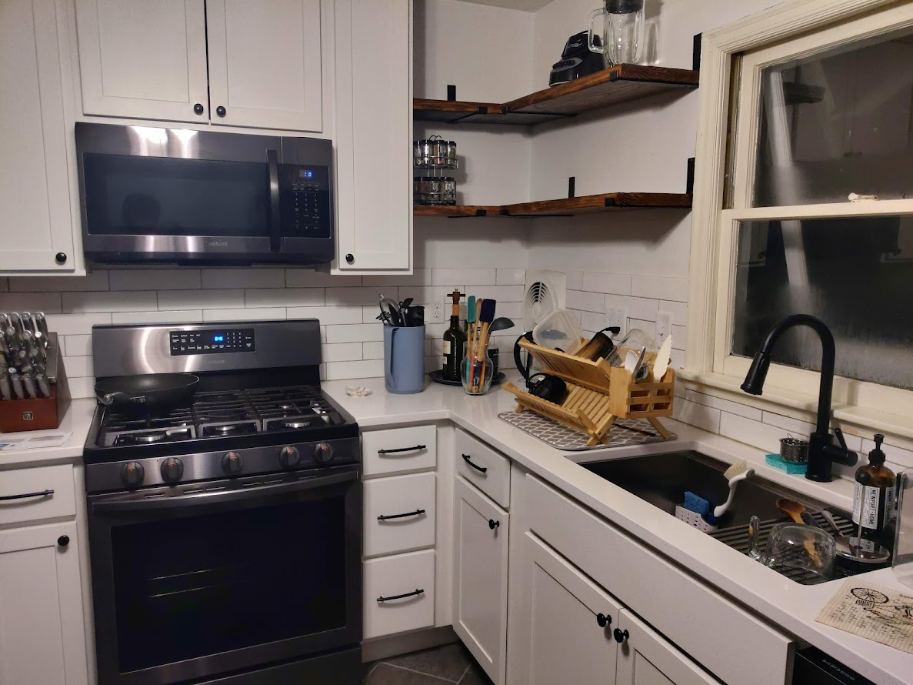

My wife and I decided to completely remodel our kitchen... ourselves. We originally planned
to hire a contractor because our house is old and our kitchen needed some professional loving.
We have absolutely no experience working with contractors or handling estimates or anything 
like that. After the third contractor we contacted and begged for a quote (which they changed
for a third time right before we were about to sign) we decided to not hire anyone and do it 
ourselves :triangular_flag_on_post:. We had no tools, no idea where to start, and absolutely no idea how long it would
take us. With all that in mid, we thought Christmas break would be enough :triangular_flag_on_post: :triangular_flag_on_post:

As I mentioned before, our kitchen desperately needed love. Someone made custom cabinets and
nailed them to the roof and wall. Also, someone added a huge built-in piece of furniture in a tiny
kitchen. Instead of saying that it was over our heads, we got some PPE over them, and started 
demolishing the cabinets. We cursed the whole time. We fought with cabinets that were nailed 4 
inches into the studs and we prevailed-- the walls didn't. "Ehm, honey? We need to fix the drywall."
At least that's what we thought the walls were made of, but, um, no. Our walls are plaster.

After we removed all the cabinets, we realized that the kitchen electric was not up to code. The
fridge was connected to an adapter and the grounding cable was dangling there. 
While we thought what to do about that, we removed the floating floor and the tiles that were glued 
under it. After sanding the black tar that was glued to the wood subfloor, we realized that the tiles
and glue might contain asbestos. We were sanding the possibly asbestos filled tiles and tar on 
Christmas day. We sent samples to a lab to check if they were dangerous to dispose with the rest
of the building materials, and luckily, the result came back as negative, so it was safe to 
remove and dispose. Still, those 4 days waiting for the results were a nightmare. The information 
about asbestos and the health issues it causes are not clear in the government websites-- we 
thought that we might have inhaled a material containing asbestos and that developing 
asbestosis was most likely, but that's a topic for another day.

After an electrician brought our kitchen up to code, we removed the remaining tile from the 
subfloor and demolished the closet. Then we patched the holes in the wall and floor. We then 
had no idea what to do. We already bought 12x24 tile and mortar that was sitting in our 
living room, but we still had that black tar in the subfloor. We learned that we could
add cement and level the room, and then add the decoupling mat. Now it was January and we were
mixing cement outside in very cold weather.

And the final product:

We did everything except for the electric and plumbing! We used construction wood to make the shelves.